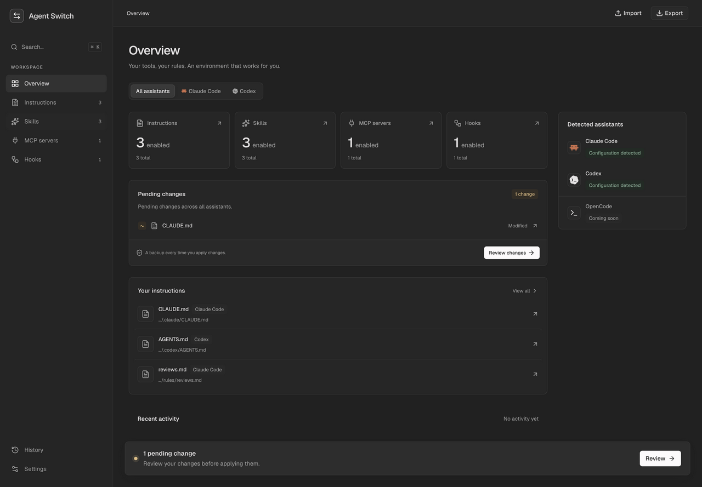
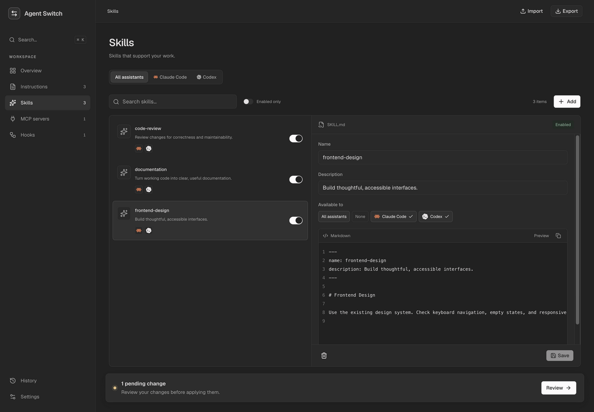
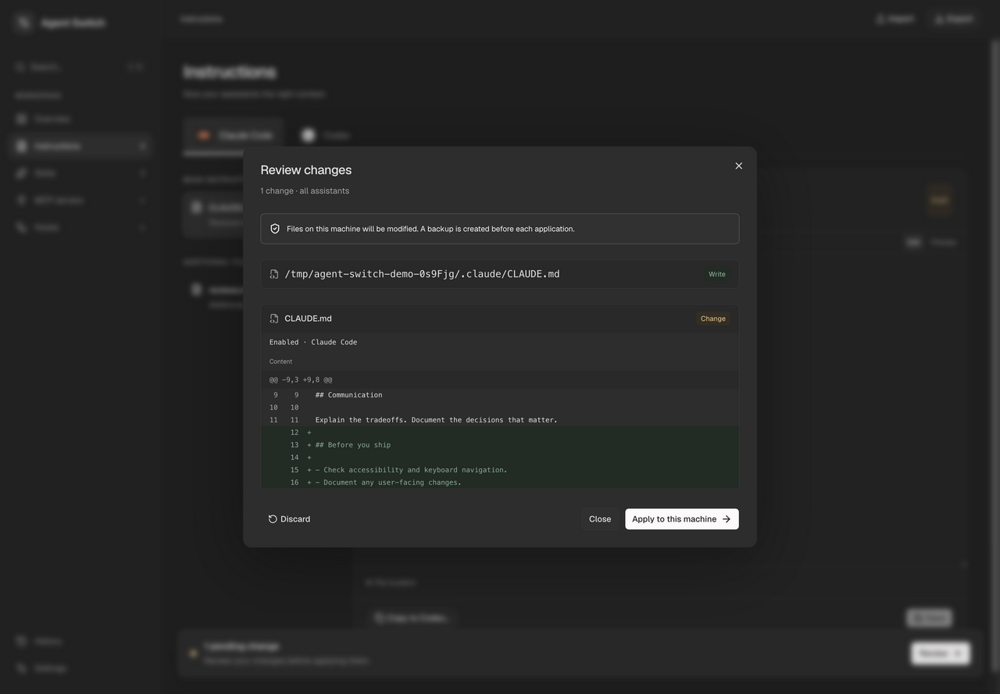

<div align="center">

# Agent Switch

**Your coding assistants. One place to configure them.**

Manage Claude Code and Codex instructions, skills, MCP servers, and hooks from a local interface.
Review the diff. Apply when you're ready.

[Getting started](#getting-started) · [Documentation](docs/README.md) · [Contributing](CONTRIBUTING.md) · [Report a bug](https://github.com/ayoub9360/agent-switch/issues/new?template=bug_report.yml)

[](LICENSE)
[](package.json)
[](docs/configuration.md)

</div>



## Less file hunting. More control.

Your assistant setup lives across Markdown, JSON, TOML, and skill directories.
Agent Switch brings those files into one workspace while keeping each assistant's
native configuration.

- **See your setup at a glance.** Browse instructions, skills, MCP servers, and
  hooks; filter by Claude Code or Codex.
- **Give each assistant the right instructions.** Edit Markdown with a preview,
  manage Claude rules and Codex overrides, and copy instructions between assistants.
- **Keep a shared skill library.** Choose which assistants receive each skill,
  including its supporting files. Disable a skill without losing its folder.
- **Review before you write.** Changes stay in a draft until you apply them.
  Inspect diffs and file operations, with backups and conflict detection.
- **Bring your setup with you.** Export and import configuration as JSON, or use
  the CLI against the same local service.

<table>
<tr>
<td width="50%"></td>
<td width="50%"></td>
</tr>
<tr>
<td align="center">One skill library, explicit assistant targets.</td>
<td align="center">See exactly what changes before applying.</td>
</tr>
</table>

_Screenshots show the running application with fictional data. Reproduce them with
[the isolated demo](docs/development.md#isolated-demo)._

## Getting started

Requires **Node.js 22.12+** and **pnpm 12.8.1**.

```bash
git clone https://github.com/ayoub9360/agent-switch.git
cd agent-switch
pnpm install --frozen-lockfile
pnpm build
pnpm start
```

Open **http://127.0.0.1:4141**. Agent Switch discovers the global configuration of
the account running the server. Edits remain drafts until you review and apply
them. Stop the server with `Ctrl+C`.

**Want to look around first?** After building, run `pnpm demo` instead of
`pnpm start`. It uses a temporary home with sample configurations and leaves your
own assistant files alone.

The corrected npm release `0.1.1` is being prepared. The initial `0.1.0` release
predates the security fixes and bundled license notices in this checkout. Until
`0.1.1` is available, use the source instructions above or
[build an installable archive](docs/cli.md#build-a-local-package).

## A simple workflow

1. **Discover** your existing global configuration.
2. **Edit** instructions, select skill targets, or update MCP and hook settings.
3. **Review** pending changes and the planned file operations.
4. **Apply** to write the native files and create backups.

History keeps the latest 30 revisions. Restoring a revision prepares a draft for
another review; it does not immediately overwrite assistant files.

## What is supported?

| Capability   | Claude Code                     | Codex                                        |
| ------------ | ------------------------------- | -------------------------------------------- |
| Instructions | `CLAUDE.md` and `rules/**/*.md` | `AGENTS.md` and `AGENTS.override.md`         |
| Skills       | `.claude/skills/`               | `.agents/skills/` and `.codex/skills/`       |
| MCP servers  | `.claude.json`                  | `.codex/config.toml`                         |
| Hooks        | `.claude/settings.json`         | `.codex/config.toml` and `.codex/hooks.json` |

Paths above are relative to your home directory by default. Custom assistant
paths are supported. See [configuration and file behavior](docs/configuration.md).

Agent Switch currently manages **one global configuration**. Project-level
configurations, multiple profiles, managed administrator settings, plugin
contents, and OpenCode integration are not supported. It configures assistants;
it does not run chat sessions or switch their models.

The service has access to your assistant configuration. Keep it on localhost or a
trusted private network; it has no user authentication. MCP connection tests can
start configured commands, and exported configurations can contain secrets.
See [security](SECURITY.md) before exposing the service or sharing an export.

## Documentation

| I want to…                                        | Read                                       |
| ------------------------------------------------- | ------------------------------------------ |
| Understand drafts, skills, and the daily workflow | [User guide](docs/user-guide.md)           |
| Change paths, ports, or run on a private server   | [Configuration](docs/configuration.md)     |
| Use the terminal or package the launcher          | [CLI reference](docs/cli.md)               |
| Resolve a conflict or connection problem          | [Troubleshooting](docs/troubleshooting.md) |
| Work on the code or reproduce screenshots         | [Development](docs/development.md)         |
| Understand the implementation                     | [Architecture](docs/architecture.md)       |

## Contributing

Bug reports, documentation improvements, and focused pull requests are welcome.
Start with [CONTRIBUTING.md](CONTRIBUTING.md) for setup, checks, and contribution
scope. For feature ideas, [open an issue](https://github.com/ayoub9360/agent-switch/issues/new?template=feature_request.yml)
and describe the workflow you want to improve.

## License

[MIT](LICENSE). Assistant names and logos belong to their respective owners.
Agent Switch is an independent project, not affiliated with or endorsed by
Anthropic or OpenAI. See [third-party notices](THIRD_PARTY_NOTICES.md).
