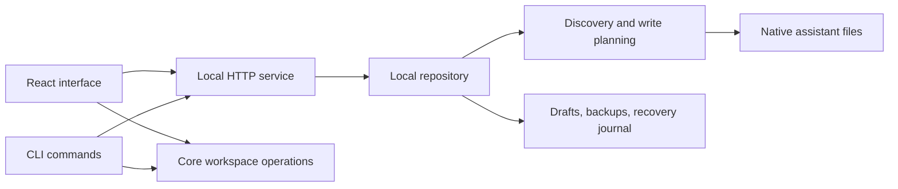

# Architecture

Agent Switch is a TypeScript monorepo using pnpm workspaces and Turborepo.
React renders the browser interface; a Node.js service owns discovery and native
file writes. Both the browser and CLI use the same HTTP API.

## Package boundaries

| Location                        | Responsibility                                                 |
| ------------------------------- | -------------------------------------------------------------- |
| `packages/core/src/`            | Domain types, schemas, validation, workspace operations, ports |
| `packages/ui/`                  | Shared shadcn/ui components and styling primitives             |
| `apps/web/src/application/`     | Browser-facing application service exports                     |
| `apps/web/src/infrastructure/`  | HTTP repository, browser runtime, JSON transfer                |
| `apps/web/src/presentation/`    | React pages, observable controller, dialogs, styles            |
| `apps/web/src/app/bootstrap.ts` | Adapter composition                                            |
| `apps/server/src/machine.ts`    | Discovery, bindings, target resolution, write plans            |
| `apps/server/src/files.ts`      | File primitives, hashes, path validation                       |
| `apps/server/src/skill-*.ts`    | Skill files, storage, linked-root materialization              |
| `apps/server/src/store.ts`      | Workspace persistence, transactions, history, recovery         |
| `apps/server/src/http.ts`       | HTTP adapter and built web assets                              |
| `apps/server/src/mcp.ts`        | Real MCP connection tests with timeouts and cleanup            |
| `apps/server/src/service.ts`    | Composition, instance lock, endpoint discovery, shutdown       |
| `apps/server/src/cli.ts`        | CLI adapter for workspace operations                           |
| `packages/cli/`                 | npm launcher and bundled distribution                          |

The domain package does not depend on React or Node filesystem APIs. Keep
validation and workspace behavior there; filesystem operations belong in the
server adapters. UI state and browser-only capabilities remain in the web app.

## State and writes

A workspace has one global configuration, a draft resource list, an applied
baseline, and revision history. The version 1 format retains `profiles` and
`activeProfileId` for compatibility, but the product supports exactly one global
profile. These names are not evidence of multi-profile functionality.

Discovery produces resources plus internal bindings to native files. Applying
builds a plan of writes, deletes, moves, skill copies, and linked-root operations.
Fingerprints guard against external file changes. HTTP revisions guard against
stale browser/CLI writes. Writes are serialized by the service, backed up, and
recorded in a recovery journal. Temporary files and renames replace file contents;
rollback covers partial operations, including skill moves/materializations.

## HTTP adapter

This is the app's internal API, not a versioned public API contract. Prefer the
CLI for scripting. Every API request requires `X-Agent-Switch: 1`. Browser
origins and request hosts are checked against the configured allowlist and local
server address. Mutations below require
the current workspace `ETag` in `If-Match`, except the MCP test.

| Method | Route                     | Purpose                               |
| ------ | ------------------------- | ------------------------------------- |
| GET    | `/api/health`             | Service identity, PID, web capability |
| GET    | `/api/workspace`          | Workspace with current ETag           |
| PUT    | `/api/workspace`          | Save validated draft state            |
| GET    | `/api/discovery`          | Discover native resources             |
| POST   | `/api/refresh`            | Refresh disk state                    |
| POST   | `/api/import-machine`     | Import selected detected resources    |
| POST   | `/api/profiles/:id/plan`  | Preview file operations               |
| POST   | `/api/profiles/:id/apply` | Apply transaction                     |
| POST   | `/api/mcp/test`           | Test a server configuration           |

Plan/apply accept `skillEditMode: "local"` (default) or `"shared"`. Stale revisions
return HTTP 409. The request body limit is 25 MB, separate from browser import
and individual skill-file limits. These headers are not credentials; network
access grants substantial local configuration access.

## Distribution

The root package is private to prevent accidental monorepo publication.
`packages/cli` is the publishable `@ayoub9360/agent-switch` package. Its esbuild
step bundles internal code; runtime external dependencies are declared in its
manifest. Built web assets are copied into the package, so end users need only
Node.js and npm. No workspace dependencies are required at runtime.
