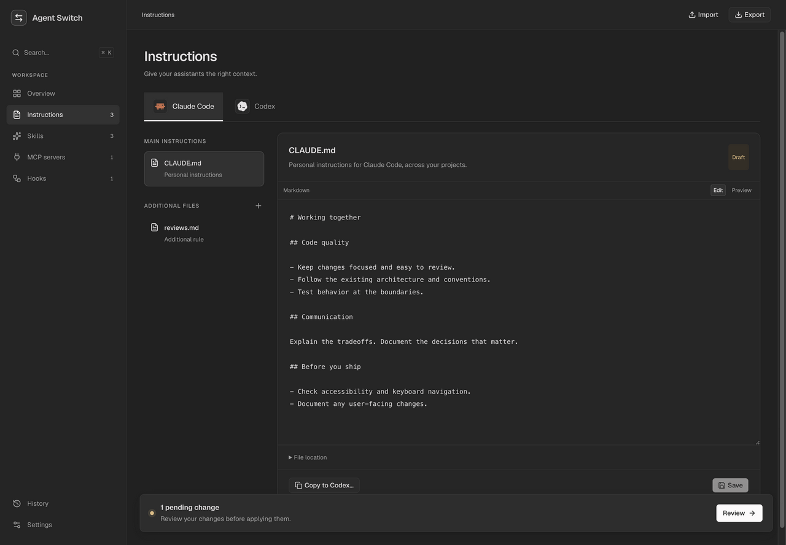

# User guide

## First launch

Follow the [quick start](../README.md#getting-started), then open the local URL.
The initial workspace is built from the global assistant configuration already
present on the server's machine. A remote browser does not grant access to files
on the browser's computer.

The overview shows your instructions, skills, MCP servers, hooks, and pending
changes. Filter by assistant to focus on Claude Code or Codex. `Ctrl+K` / `⌘K`
opens the command palette.

Agent Switch manages a single global configuration. It does not discover project
repositories, create profiles, or install the assistants themselves.

## Draft → review → apply

Saving an editor updates the draft in `~/.agent-switch/workspace.json`.
It does not yet update native assistant files.

Open **Review changes** to inspect the diffs and planned file operations. Apply
only after checking the destinations. The service backs up previous files and
checks for outside changes before writing. The CLI exposes the same plan with
`pnpm cli plan`.

Refresh from disk after editing assistant files in another application. Refresh
preserves drafts and updates the disk baseline. After a conflict, compare your
draft with that new baseline before applying again.

History retains 30 revisions, including a restore point before the first apply.
Restoring creates a draft; review and apply it to change native files. Disk
backups are separate from history and are not automatically pruned.

## Instructions

The Instructions page has separate Claude Code and Codex tabs. Each assistant
keeps its own files and Markdown content:

- Claude Code: the main `CLAUDE.md` and additional Markdown rules under `rules/`.
- Codex: the main `AGENTS.md` and an existing `AGENTS.override.md`.

A nonempty Codex override takes precedence over the main file. The interface
shows the state on disk separately from the draft. Clear or remove an existing
override to restore the main instructions.

Use the Markdown editor or preview. Main instruction files have fixed names and
destinations; a missing main file is created after review and apply. Existing
symbolic links remain in place, and their resolved destinations appear in the
details.

**Copy to…** appends to or replaces the other assistant's main instructions.
Review and adapt the result before saving. This is a one-time copy, not ongoing
synchronization: assistant-specific imports, paths, and commands are not translated.



## Skills

A skill is one library item with zero, one, or both assistants selected. Its
`SKILL.md` must have YAML frontmatter with `name` and `description`:

```markdown
---
name: code-review
description: Review changes for correctness and maintainability.
---

# Code review

Focus on regressions, behavior at boundaries, and actionable findings.
```

Identical copies discovered across assistants are grouped. Different versions
remain separate and produce a warning. Supporting files, binary assets, and
executable permissions are included in portable exports. `agents/openai.yaml`
is retained in the library and distributed only to Codex when creating an
assistant-specific copy.

Editing a linked skill creates an independent local copy for the selected
assistants by default. **Edit shared sources** in the review explicitly opts into
editing the shared source; the review identifies affected linked assistants.
Local copies of a linked folder preserve its supporting files and permissions.

Disabling and applying archives the local skill entry under
`~/.agent-switch/disabled-skills/`. The skill stays in the library. Re-enabling
and applying restores it, including links, empty folders, and file modes. A
conflicting existing destination blocks restoration instead of being overwritten.
Removed skills are also set aside.

When the discovery root itself is a link, Agent Switch can replace that root
with individual links to isolate changes. Replaced entries are kept in
`~/.agent-switch/replaced-skills/` and recorded for recovery. An external sync
process may recreate links; refresh after it runs. A terminal inside an old
linked directory may need to leave and re-enter the assistant path.

## MCP servers

Edit a server's JSON configuration and choose its assistant targets. The app
writes the appropriate native JSON or TOML configuration. Some transport and
authentication fields are assistant-specific; incompatible conversions are
rejected with an explanation rather than silently copied.

The connection test performs a real MCP initialization over stdio, HTTP, or SSE,
then closes the connection. It does not call business tools. A stdio test starts
the configured command: only test configurations you trust. Install required
executables, packages, and credentials separately.

## Hooks

Hooks are edited in their native JSON structure: events, matcher groups, and
handlers. Agent Switch saves their configuration; the assistant executes them.
A hook valid for one assistant is not automatically portable to the other.
External scripts referenced by hooks are not bundled into exports.

## Import and export

**Import from the machine** adds missing discovered resources while preserving
existing drafts. **Import JSON** merges a portable configuration into the draft;
review and apply afterward. Matching name, kind, and assistant targets update an
existing resource; skills match by name.

Exports include skill files and executable modes, but not external hook scripts
or MCP packages. The browser import limit is 20 MB; each skill file is limited to
5 MB. Exports can contain credentials from your configuration. Inspect them
before sharing or attaching them to an issue.

The export format still uses the internal name `agent-switch-profile` and
version `1`. There is exactly one global profile. Project-scoped exports are
rejected; compatibility fields remain `path: ""` and `scope: "global"`.

## Backups and migration

Previous native files are stored in `~/.agent-switch/backups/`. Writes use
file replacements and a transaction journal. On a write failure, completed
operations are rolled back; an interrupted transaction is recovered at startup.
Backups are local recovery data, not an encrypted secret store.

Older multi-profile workspaces are migrated to one global configuration.
Pre-migration workspace snapshots are saved as
`before-single-configuration-*.json` or `before-global-only-*.json` in the backup
directory. The selected configuration and its draft are retained, without
writing to assistant files or project repositories during migration.

See [configuration](configuration.md) for paths and
[troubleshooting](troubleshooting.md) for recovery guidance.
